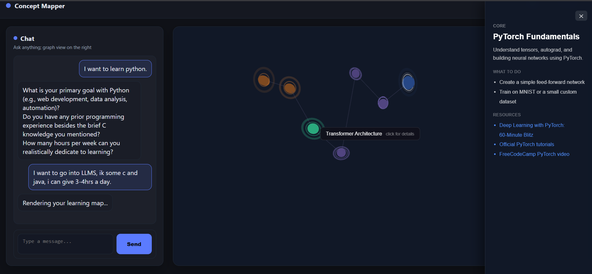

# Concept Mapper 🌐

> Turn any learning goal into an interactive 3D roadmap — powered by AI.

Concept Mapper is an AI-powered web application that takes a topic you want to learn, asks you a few clarifying questions, and generates a personalized learning path visualized as an interactive 3D knowledge graph. Click any node to see what to do, what to study, and where to find the best resources.

---

## Demo



---

## Features

- **Two-phase AI conversation** — The AI first asks 2-3 clarifying questions to understand your goals, then generates a structured learning path
- **Interactive 3D graph** — Nodes rendered in Three.js with planet-like textures, animated pulse rings, and glow effects
- **Full camera control** — Left drag to rotate, right drag to pan, scroll to zoom
- **Rich node detail panel** — Click any node to see description, tasks, and clickable resources
- **Start node marker** — The first node in your path is visually marked so you always know where to begin
- **Multi-turn memory** — The AI remembers the full conversation context across messages
- **Clickable resources** — Links open directly; named resources open a Google search

---

## Tech Stack

| Layer | Technology |
|---|---|
| Backend | Python, Flask |
| AI | OpenRouter API (`gpt-oss-120b`) |
| 3D Visualization | Three.js (r158) |
| Frontend | HTML, CSS, Vanilla JS |
| Environment | python-dotenv |

---

## Project Structure

```
concept-mapper/
│
├── app.py               # Flask backend — routes, AI integration, memory
├── templates/
│   └── index.html       # Frontend — chat UI + Three.js 3D graph
├── static/
│   └── style.css        # Styling
├── .env                 # API keys (not committed)
├── requirements.txt
└── README.md
```

---

## Getting Started

### 1. Clone the repository

```bash
git clone https://github.com/yourusername/concept-mapper.git
cd concept-mapper
```

### 2. Install dependencies

```bash
pip install flask openai python-dotenv
```

### 3. Set up your API key

Create a `.env` file in the root directory:

```
OPENROUTER_API_KEY=your_openrouter_api_key_here
```

Get your free API key at [openrouter.ai](https://openrouter.ai)

### 4. Run the app

```bash
python app.py
```

Open your browser at `http://localhost:5000`

---

## How It Works

```
User types a topic
        ↓
Flask receives message → appends to conversation history
        ↓
OpenRouter API called with full history + system prompt
        ↓
Phase 1: AI asks 2-3 clarifying questions
        ↓
User answers → AI generates JSON learning path
        ↓
Flask detects JSON → returns { type: "graph", graph: data }
        ↓
Three.js renders 3D node graph from JSON
        ↓
User clicks node → side panel shows tasks + resources
```

### JSON Graph Format

The AI returns a structured JSON object that the frontend renders:

```json
{
  "type": "graph",
  "nodes": [
    {
      "id": "1",
      "label": "Python Basics",
      "description": "Variables, loops, functions and syntax fundamentals.",
      "type": "foundation",
      "tasks": ["Complete Python crash course", "Build a CLI calculator"],
      "resources": ["Python.org docs", "https://docs.python.org"],
      "x": 0, "y": 0, "z": 0
    }
  ],
  "edges": [
    { "from": "1", "to": "2" }
  ]
}
```

Node types and their colors:

| Type | Color |
|---|---|
| `foundation` | Blue `#4f8eff` |
| `core` | Purple `#a78bfa` |
| `advanced` | Green `#34d399` |
| `project` | Orange `#fb923c` |

---

## Key Design Decisions

**Why manual orbit controls instead of OrbitControls.js?**
OrbitControls was removed from the Three.js CDN bundle in r125+. Rather than fighting import maps, the camera orbit is implemented manually using spherical coordinates (~25 lines), giving full control with zero dependencies.

**Why normalize node positions?**
The AI returns arbitrary x/y/z values. Rather than multiplying blindly (which sent nodes off-screen), positions are remapped to a fixed bounding box so the graph always fits in view regardless of what the model returns.

**Why strip the `:online` suffix from the model?**
The online variant triggers web search, causing the model to fetch entire articles (4000+ tokens per request). Using training knowledge for resources keeps costs low and responses fast.

---

## Roadmap

- [ ] Export learning path as PDF
- [ ] Save and reload past graphs
- [ ] Multi-session support (currently hardcoded to `user1`)
- [ ] Node labels rendered in 3D space (Three.js Sprites)
- [ ] Dark/light theme toggle

---

## Author

**Manas Kiyagi**
BTech Information Technology, VIT Vellore

[LinkedIn](https://linkedin.com/in/yourprofile) · [GitHub](https://github.com/yourusername)

---

## License

MIT License — feel free to use, modify, and build on this.
